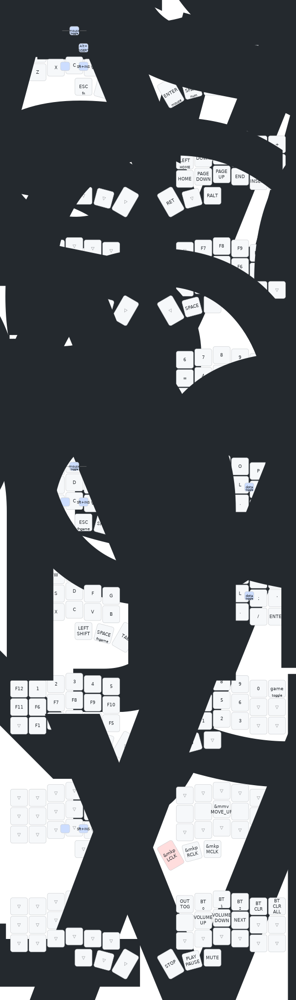

## Corne MX
- 42 Teclas;
- Wireless;
- Dongle Mode;
- Teclas MX;
- Brown switches;
-  KLP Lame keycaps

## Flashing:
    1. Turn all controllers off
    2. Flash the dongle controller with the appropriate settings_reset file.
    3. Flash the dongle controller with the dongle file.
    4. Flash the first half with the the settings_reset file.
    5. Flash the first half with the left or right files.
    6. Repeat steps 4 and 5 for the other half.

> ![WARNING]
> When using both Nice!Nano microcontrollers, make sure you are flashing them with the correct files!

### Keymap:
Heavily based on [Miryoku Layout](https://github.com/manna-harbour/miryoku), with some changes to fit my needs.

### Layout:

### Log
https://gist.github.com/redmasters/c388c28b4bfd8b269c60cc647f9fd280
