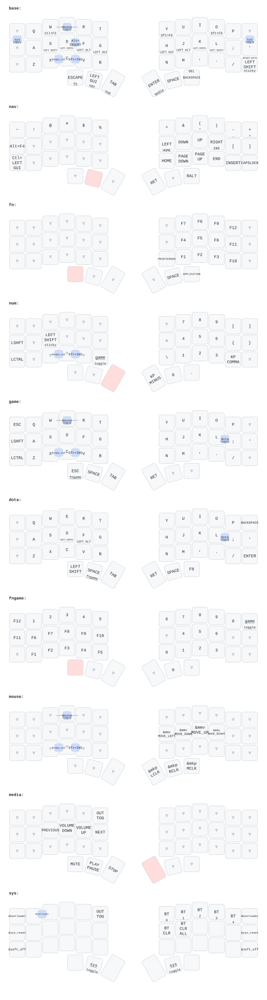

## Corne MX
- 42 Teclas;
- Wireless;
- Dongle Mode;
- Teclas MX;
- Brown switches;
-  KLP Lame keycaps

## Flashing

The dongle is the ZMK central and both keyboard halves are peripherals. Keymap
processing happens primarily on the central, so a keymap-only update normally
requires flashing only `corne_dongle`. A regular firmware update does **not**
require `settings_reset`; standard firmware preserves the existing split and
host bonds.

### Keymap-only update

Recommended when only `config/corne.keymap` has changed:

1. Flash `corne_dongle` to the dongle.
2. Reconnect or restart the dongle.
3. Test the changed bindings.

The halves do not normally need to be reflashed because the dongle owns the
keymap state. See [ZMK Split Keyboards](https://zmk.dev/docs/features/split-keyboards#central-and-peripheral-roles).

### Full firmware update without resetting bonds

Recommended after ZMK/module upgrades or changes that affect all controllers:

1. Turn both keyboard halves off.
2. Flash `corne_dongle` to the dongle.
3. Flash `corne_left` to the left half.
4. Flash `corne_right` to the right half.
5. Reconnect the dongle and turn both halves on.

With existing bonds intact, the left and right halves may be flashed in either
order. Flashing the dongle first is a project convention, not a ZMK pairing
requirement.

### First dongle setup or changing the central/peripheral topology

Use this procedure when introducing the dongle for the first time, changing
which controller is central, replacing controllers, or deliberately starting
with clean bonds:

1. Turn both keyboard halves off.
2. Flash `settings_reset` to the dongle.
3. Flash `settings_reset` to the left half.
4. Flash `settings_reset` to the right half.
5. Flash `corne_dongle` to the dongle.
6. Flash `corne_left` to the left half.
7. Flash `corne_right` to the right half.
8. Reconnect the dongle.
9. Turn on the left half and wait for it to connect.
10. Turn on the right half and wait for it to connect.
11. Remove the old keyboard entry from the host, then pair it again.

ZMK requires clearing old bonds when converting an existing split to a dongle
topology. Pairing the left peripheral before the right is also recommended for
dongle displays that assign battery widgets by connection order. See
[ZMK Dongle Setup](https://zmk.dev/docs/hardware-integration/dongle),
[ZMK Connection Issues](https://zmk.dev/docs/troubleshooting/connection-issues),
and [ZMK Dongle Screen Pairing](https://github.com/janpfischer/zmk-dongle-screen#pairing).

### Recovering broken split pairing

Use this only when a half no longer connects after normal restarts:

1. Flash `settings_reset` to the dongle and both halves.
2. Flash the matching runtime image to each controller.
3. Reconnect the dongle.
4. Power on the left half and wait for it to connect.
5. Power on the right half.
6. Forget the keyboard on every host and pair it again.

`settings_reset` erases persistent settings, including Bluetooth profiles and
output selection. Do not use it as part of routine updates. The official reset
procedure is documented in
[ZMK Connection Issues](https://zmk.dev/docs/troubleshooting/connection-issues#split-keyboard-parts-unable-to-pair).

> [!WARNING]
> Always match `corne_dongle`, `corne_left`, and `corne_right` to the correct
> Nice!Nano. Do not disconnect or overwrite the wrong mounted bootloader drive.

### Keymap:
Heavily based on [Miryoku Layout](https://github.com/manna-harbour/miryoku), with some changes to fit my needs.

The home-row modifiers and tap-hold tuning are also inspired by
[urob's ZMK configuration](https://github.com/urob/zmk-config#timeless-homerow-mods).

#### Shift states

The keymap deliberately provides several Shift modes for different contexts:

| State | Binding | Result |
|---|---|---|
| Home-row Shift | Hold `S` or `L` on Base | Holds `Left Shift` while another key is pressed. The positional hold-tap tuning favors normal same-hand rolls as taps. |
| Sticky Shift | Tap the outer-right `smart_shift` key on Base | Applies `Left Shift` to the next key. It expires after 900 ms and releases immediately after use. |
| Caps Word | Activate `smart_shift` while `Left Shift` is already held | Starts Caps Word for identifiers and consecutive capital letters. |
| Number-layer Shift | Hold the left outer Shift key, or tap sticky Shift, on Num | Provides conventional or one-shot Shift while entering numbers and symbols. |
| Game Shift | Hold the left outer key on Game | Uses a plain `Left Shift` without home-row tap-hold behavior. |
| Dota Shift | Hold the left outer thumb on Dota | Uses a dedicated plain `Left Shift` suited to gameplay. |
| Shift + Backspace | Hold either Shift and press the Base Backspace/Delete key | The mod-morph emits `Delete`; without Shift it emits `Backspace`. |

The Base home-row Shift behaviors use the same 280 ms balanced, positional
hold-tap strategy described by urob. Sticky Shift is intended for capitalization
without timing a home-row chord, while Caps Word handles longer uppercase
sequences.

### Layout:

### Log
https://gist.github.com/redmasters/c388c28b4bfd8b269c60cc647f9fd280
